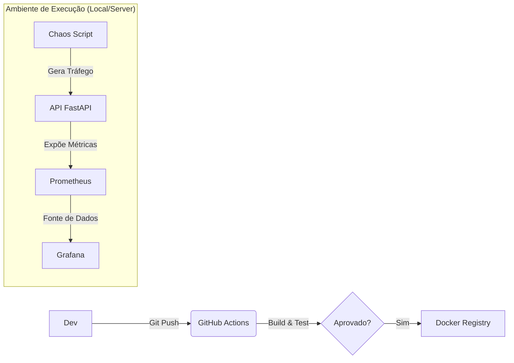

# ⚡ DevOps Flash Project: Pipeline CI/CD & Observabilidade

[](https://github.com/AlanStacholski/projeto-devops-webServices/actions/workflows/ci.yml)


> **Projeto prático de Engenharia de Software simulando um ambiente de produção completo com instrumentação de métricas, containerização e testes automatizados.**

---

## 🎯 O Objetivo
Sair da teoria e implementar um fluxo de **DevOps Real**. O projeto consiste em uma API instrumentada que passa por uma esteira de CI (GitHub Actions), é empacotada em containers e monitorada em tempo real com métricas de SRE (Latência, Throughput e Taxa de Erros).

## 🏗️ Arquitetura e Stack

A solução foi desenhada para ser agnóstica de Cloud, rodando totalmente em containers.

* **App:** Python (FastAPI) com instrumentação nativa via Middleware.
* **Containerização:** Docker e Docker Compose.
* **Orquestração de Dados:** Prometheus (Coleta/TSDB).
* **Visualização:** Grafana (Dashboards).
* **Automação (CI):** GitHub Actions (Build & Test).
* **Teste de Carga:** Script de *Chaos Engineering* customizado para simular tráfego e erros.



---

## 🚀 Como Rodar Localmente

Pré-requisitos: `Docker`, `Docker Compose` e `Python` instalados.

### 1. Clone o repositório

```bash
git clone [https://github.com/SEU_USUARIO/NOME_DO_REPO.git](https://github.com/SEU_USUARIO/NOME_DO_REPO.git)
cd NOME_DO_REPO

```

### 2. Suba a Infraestrutura

```bash
docker-compose up -d --build

```

*Isso iniciará a API (p8000), Prometheus (p9090) e Grafana (p3000).*

### 3. Inicie o "Gerador de Caos" (Simulação de Tráfego)

Em um novo terminal, execute o script que simula usuários reais acessando o sistema:

```bash
pip install requests
python chaos.py

```

*Você verá logs dos bots acessando a API, gerando sucessos, lentidão e erros 500 propositais.*

---

## 📊 Observabilidade (Dashboard)

Acesse o Grafana para ver a mágica acontecer:

* **URL:** `http://localhost:3000`
* **Login:** `admin` / `admin`
* **Dashboard:** Importe o ID **16135** (FastAPI Observability) ou crie painéis manuais usando o datasource Prometheus.

### 📸 Screenshot do Projeto


---

## 💡 Evolução: IoT vs. Web Services

Este projeto marca uma evolução na minha jornada de monitoramento:

| Característica | Projeto Anterior (IoT Indústrial) | Este Projeto (Web SRE) |
| --- | --- | --- |
| **Foco** | Dados Físicos (Temp/Vibração) | **Golden Signals (Latência/Erros)** |
| **Protocolo** | MQTT (Assíncrono) | **HTTP/REST (Síncrono)** |
| **Coleta** | Exporter Customizado | **Instrumentação Nativa (Middleware)** |
| **Deploy** | Manual | **Automatizado (CI Pipeline)** |

---

## ✅ Checklist de Entrega

* [x] API com rotas de saúde e métricas (`/metrics`)
* [x] Dockerfile Otimizado
* [x] Docker Compose com 3 serviços
* [x] Pipeline de CI no GitHub Actions
* [x] Prometheus configurado (Scraping)
* [x] Script de Teste de Carga (Chaos)
* [x] Dashboard Operacional no Grafana

---

**Desenvolvido por Alan J Stacholski Júnior** 🚀

```